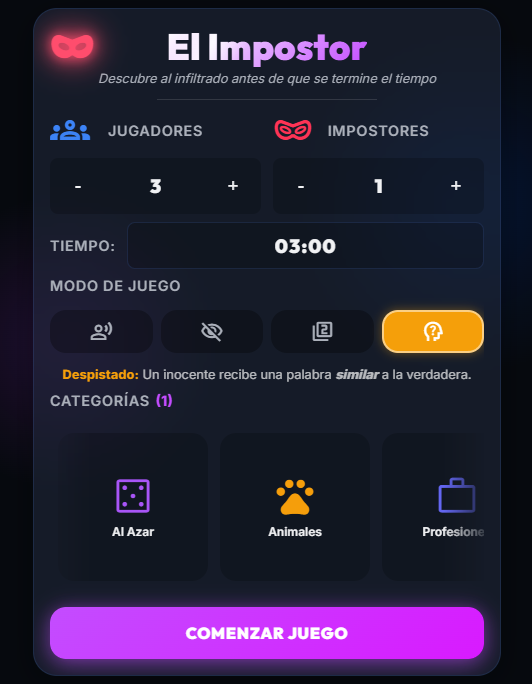

# 🕵️‍♂️ El Impostor - Juego de Mesa Digital

¡Bienvenido a **El Impostor**! Una adaptación digital del clásico juego de roles ocultos y engaño. Ideal para jugar con amigos y familiares en la misma habitación usando un solo dispositivo.

🎮 **[¡Juega ahora directamente desde tu navegador!](https://ignaciomilani.github.io/impostor-game/)**

<p align="center">
  
</p>

---

## 🎲 ¿En qué consiste el juego?

El objetivo es descubrir quién es el impostor… ¡o evitar ser descubierto si tú lo eres!

1. Se eligen categorías de palabras (ej: Animales, Comida, Países) y se configura la partida.
2. El dispositivo se pasa de mano en mano entre todos los jugadores.
3. La mayoría (los **Inocentes**) verán la **misma palabra secreta**.
4. Una minoría (los **Impostores**) verán que son el impostor.
5. Una vez que todos vieron su rol, los jugadores dicen **una sola palabra** relacionada con la palabra secreta.
6. Al final de la ronda, todos debaten y votan. Si aciertan, ganan los inocentes; si el impostor sobrevive, gana él.

El temporizador de debate se puede ajustar antes de empezar (por defecto, 1 minuto por jugador).

---

## 🔥 Modos de Juego

*   **Clásico:** Una palabra secreta de una categoría anunciada.
*   **A Ciegas:** La categoría es secreta. Nadie sabe de qué tema se habla hasta debatir.
*   **Doble Palabra:** Los inocentes reciben 2 palabras: una verdadera y una falsa de la misma categoría.
*   **Despistado:** Un inocente recibe una palabra *similar* a la verdadera (del mismo sub-grupo semántico). ¡Caos en el debate!

---

## ✨ Interfaz

*   Pantalla de configuración con diseño oscuro y estilo glassmorphism.
*   Selector de tiempo con ruedas deslizables.
*   Carrusel horizontal de categorías con iconos Material Symbols.
*   Animaciones en el título, botón de inicio y transiciones entre pantallas.
*   Sonidos al comenzar la partida y cuando se acaba el tiempo.
*   Iconos embebidos en la app (funcionan sin conexión en la APK).

---

## 🛠️ Detalles Técnicos

Proyecto web/mobile con foco en diseño responsive, bajo consumo y uso en un solo dispositivo compartido.

### Tecnologías
*   **Vite** — build y desarrollo.
*   **React** — interfaz y estado.
*   **CSS puro** — variables, glassmorphism, animaciones y layout mobile-first (`index.css`).
*   **Web Audio API** — efectos de sonido procedurales (`src/utils/gameAudio.js`).
*   **Capacitor** — compilación nativa para Android.
*   **GitHub Actions** — CI/CD y generación de `.apk`.

### Persistencia
El hook `useStickyState` guarda en `localStorage` jugadores, categorías, modo, tiempo y estado de partida para retomar sin reconfigurar.

### Estructura principal
*   `src/App.jsx` — lógica del juego, turnos y pantallas.
*   `src/categories.js` — palabras y sub-grupos semánticos (`CATEGORIES_CLUSTERED`) para el modo Despistado.
*   `src/components/` — UI reutilizable (carrusel, selector de tiempo, botón de inicio, badges, etc.).
*   `src/utils/` — audio y utilidades de tiempo.
*   `src/index.css` — estilos globales.
*   `public/fonts/` — fuente Material Symbols (offline).

---

## 🚀 Instalación y Despliegue

### Desarrollo local

```bash
npm install
npm run dev
```

### Producción

```bash
npm run build
```

### Distribución

**Versión Web** — GitHub Pages  
👉 [Jugar ahora](https://ignaciomilani.github.io/impostor-game/)

**Versión Android (APK)** — Capacitor + GitHub Actions  
👉 [Descargar APK](https://github.com/IgnacioMilani/impostor-game/releases/latest)

---
*Desarrollado con mucha pasión para engañar a tus amigos.*
